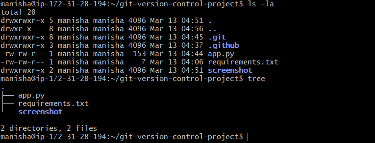
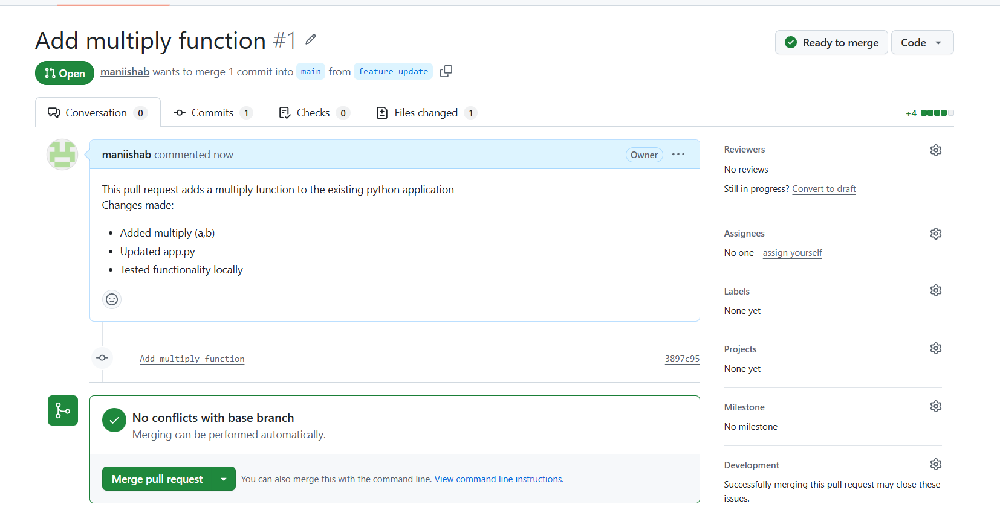
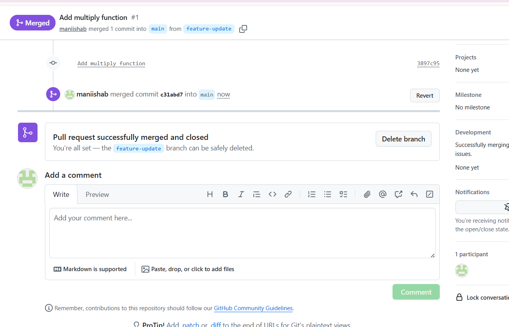
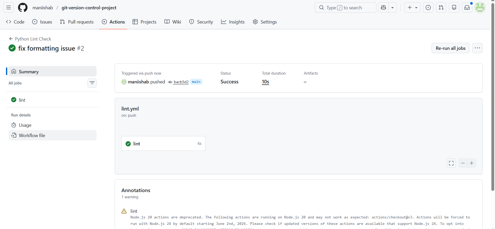

# Version Control with Git and GitHub

## Project Overview

This project demonstrates how Git can be used to manage source code efficiently using branching strategies and pull requests.

The repository also includes a basic GitHub Actions workflow that automatically performs code linting whenever changes are pushed.

## Technologies Used

- Git
- GitHub
- GitHub Actions
- Python

## Features

- Git branching workflow
- Pull request based development
- Automated lint check using GitHub Actions

## Project Structure

---

## Repository

---

## Pull Request Workflow

---

## Merge Pull Request

---

## GitHub Actions CI Pipeline

---
